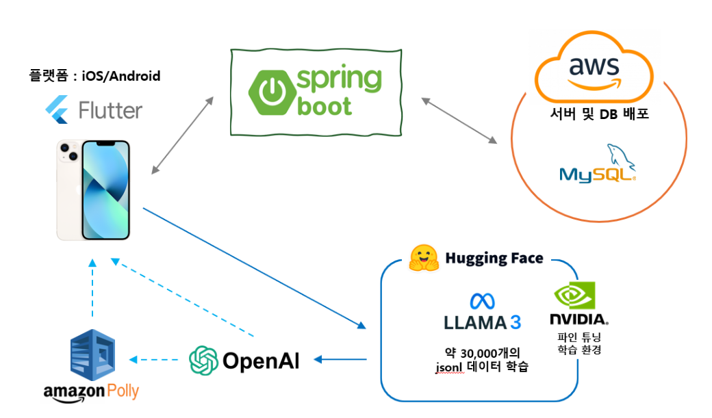
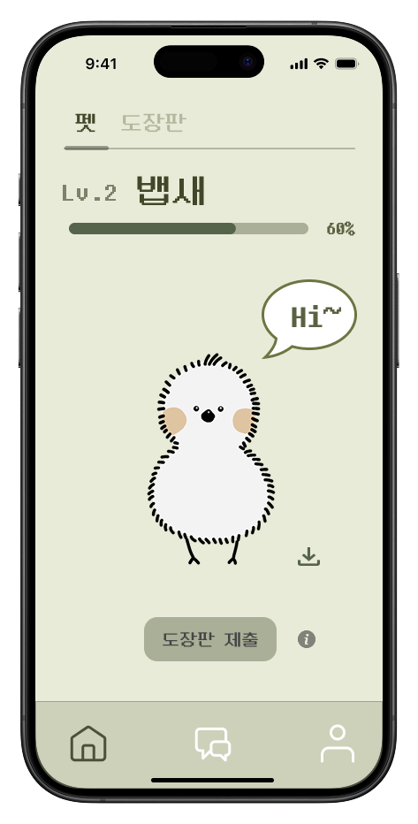
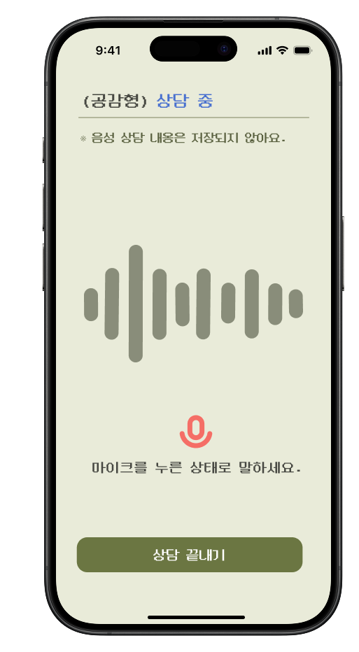
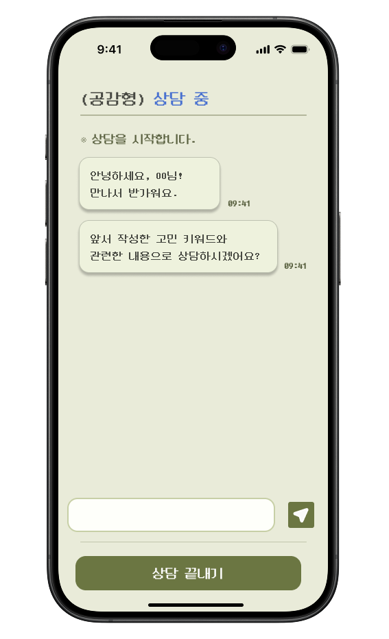
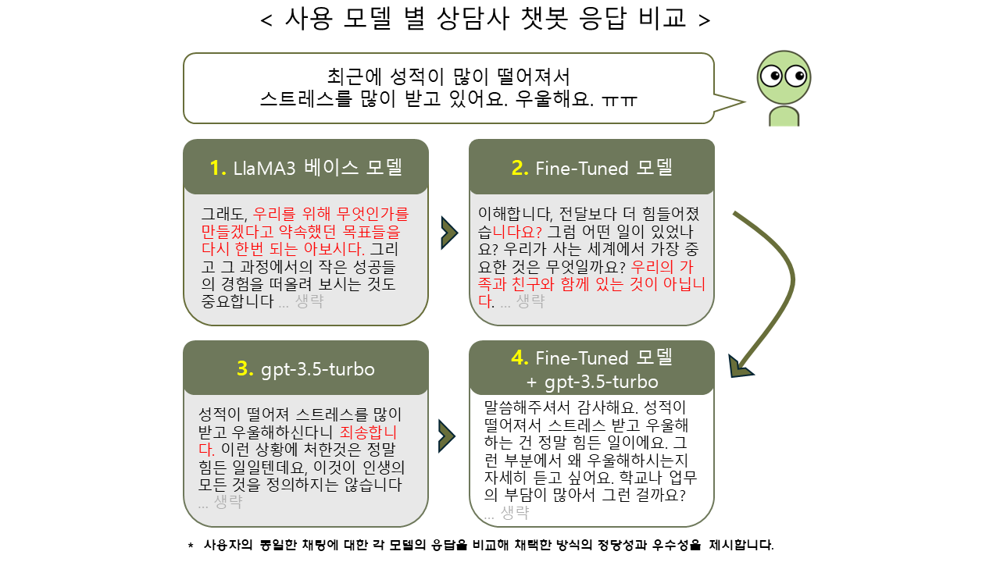

 

---

## 👨‍👩‍👧‍👧 팀원 소개

<table>
  <tbody>
    <tr>
      <td align="center"><a href="https://github.com/Park-Han-bi"> <b>박한비</b></a> </td>
      <td align="center"><a href="https://github.com/sseyeonn"> <b>정세연</b></a> </td>
      <td align="center"><a href="https://github.com/tpfls"> <b>홍세린</b></a> </td>
    </tr>
  </tbody>
</table>

---

## 🗂️ 프로젝트 개요

> **마음을 위로하는
AI 상담 챗봇 어플리케이션**

현대인은 다양한 심리적 문제에 직면하고 있지만 
정신 상담에 대한 거리감과 사회적 인식 등으로 인해 전문적인 도움을 받기
어려운 상황입니다.   
이에 본 어플리케이션은  **프라이버시가 보장된 AI 상담 챗봇**을 통해 자유로운 대화를 제공하고,  **게임적 요소**를
결합해 이용자의 몰입도와 정서 관리 효과를 높이고자 합니다.

---

## 🔑 주요 기능

- **상담 방식 선택** : 사용자 취향에 맞는 AI 상담사 선택
  
- **음성 상담 제공** : 채팅 뿐 아니라 음성 상담도 지원
  
- **도장 수집 시스템** : 상담을 완료할 때마다 도장을 하나씩 획득
  
- **캐릭터 진화** : 도장을 모아 도장판을 완성하면 캐릭터가 성장하는 보상 시스템

---

## 🎥 시연 영상

[🔗 프로젝트 시연 영상 보러가기](https://your-demo-video-link.com)

---

## ⚙️ 프로젝트 구조도

  

---

## 📸 화면 미리보기

  
  
  

---

## 🔧 Tech Stacks

 

 

---

## 🧰 주요 적용 기술 및 구조

| 항목 | 내용 |
|------|------|
| **개발 환경** | Mac OS, Windows, Linux, AWS |
| **개발 도구** | Visual Studio Code, IntelliJ IDEA |
| **개발 언어** | Dart, Java, Python |
| **프레임 워크** | Flutter, Spring Boot, PyTorch |

---

## 🤖 채택 모델

> **LLaMA 3 기반 파인튜닝 모델 + GPT-3.5-turbo 후처리**

1. 파인튜닝 : 전문 상담사의 발화 맥락 학습
2. GPT openai : 유연하고 자연스러운 말투를 지원하여 라마 모델이 반환한 응답 후처리

  

---

## 👥 역할 소개

| 이름 | 역할 | 담당 업무 |
|------|------|------------|
| 박한비 | Back-End | 팀장, 서버 구축 및 관리, 데이터베이스 설계 |
| 정세연 | Front-End | UI 설계 및 구현, 딥러닝 모델 훈련 및 연동 |
| 홍세린 | Front-End | UI 설계 및 구현, 어플리케이션 디자인 |

---

## 📎 협업 도구

- **프로젝트 관리** :  **Notion**,
   **GitHub**
- **팀 커뮤니케이션** :  **Discord**

> *해당 협업 도구들은 개발 및 일정 관리를 위해 사용되었으며, 외부 링크는 제공하지 않습니다.*

---

## ✉️ Contact

📮 문의: [capjjang0530@gmail.com](mailto:capjjang0530@gmail.com)

---

## 📚 출처

> 본 프로젝트는 여러 기술 자료 및 오픈소스를 참고하여 개발되었습니다.  
<https://aclanthology.org/2024.findings-emnlp.832/>    
> 훈련 모델 업로드 위치  
<https://huggingface.co/sseyeonn/emoti-chatbot-lora-ko-8b/>

---

